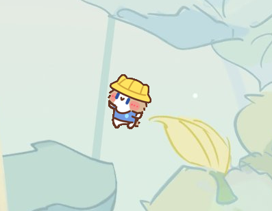
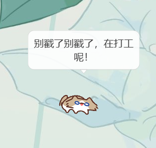
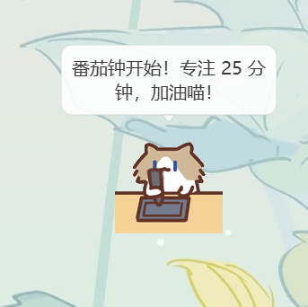
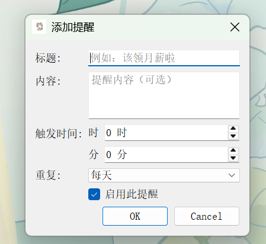
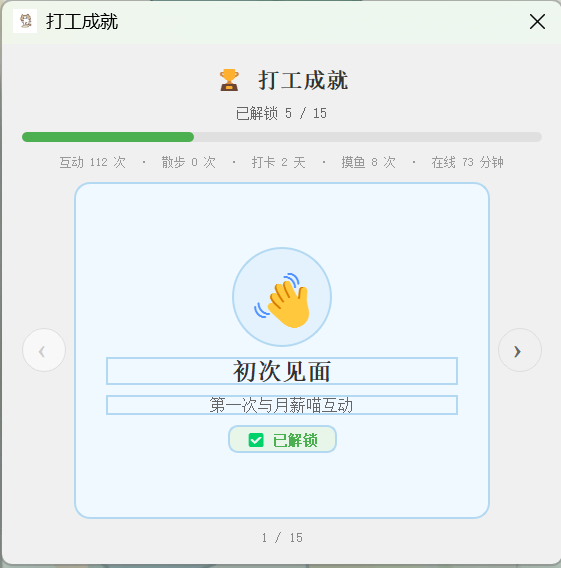
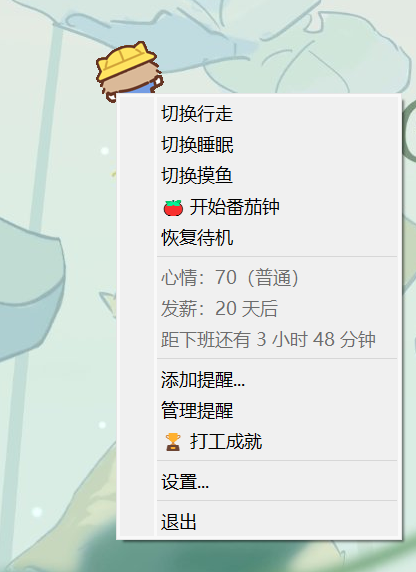
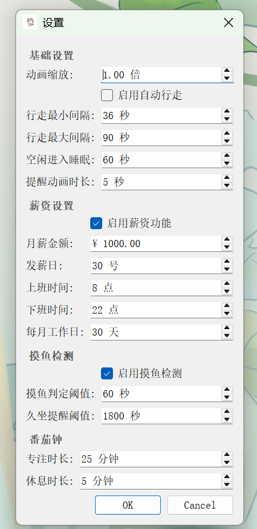

# 月薪喵 💰🐱

> 一只住在 Windows 桌面上的打工猫，陪你上班、提醒你发薪、监督你别摸鱼。

<!-- 📸 截图位置：在这里放一张桌宠在桌面上待机的截图 -->


---

## 目录

- [功能一览](#功能一览)
- [快速开始](#快速开始)
- [操作指南](#操作指南)
- [功能详解与截图](#功能详解与截图)
- [右键菜单](#右键菜单)
- [设置面板](#设置面板)
- [项目结构](#项目结构)
- [技术栈](#技术栈)
- [配置文件](#配置文件)
- [添加自定义动画](#添加自定义动画)
- [功能路线图](#功能路线图)
- [FAQ](#faq)
- [开发说明](#开发说明)

---

## 功能一览

| 功能 | 说明 |
|------|------|
| 🎬 多状态动画 | 待机、行走、互动、拖拽、睡眠、提醒、摸鱼、专注 8 种状态动画 |
| 💬 对话气泡 | 状态切换时随机弹出打工人金句气泡，跟随窗口移动 |
| 😺 心情系统 | 互动会增加心情值，长时间不理会会降低，不同心情播放不同 idle 动画 |
| 💰 发薪日倒计时 | 设置发薪日，实时显示距发薪还有多少天，临近自动提醒 |
| ⏱️ 实时时薪 | 设置月薪后，工作时段内随机弹气泡显示「今日已赚 ¥X.XX」 |
| 🏁 下班倒计时 | 实时显示距下班还有多久，到点自动提醒「下班啦！」 |
| 🐟 摸鱼检测 | 检测系统空闲时长，超阈值弹气泡吐槽，切换摸鱼动画 |
| 💺 久坐提醒 | 空闲超 1 小时提醒站起来活动 |
| 🍅 番茄钟 | 25 分钟专注 + 5 分钟休息，启动后切换专注动画 |
| 🔔 自定义提醒 | 添加一次性或重复提醒，到点弹动画 + 托盘通知 |
| 🏆 打工成就 | 15 个成就，记录互动、打卡、摸鱼等累计数据 |
| 📋 每日打卡 | 启动时自动打卡，记录连续打卡天数 |
| 🖥️ 系统托盘 | 托盘菜单快捷操作，托盘 tooltip 显示发薪倒计时 |

---

## 快速开始

### 下载可执行文件（推荐）

前往 [Releases 页面](https://github.com/guanhaisen/desktop-pet/releases) 下载 `YuexinMiao.exe`，双击即可运行，无需安装 Python 环境。

> 首次启动需几秒解压资源。若被 Windows SmartScreen 拦截，点击「更多信息 → 仍要运行」。

### 从源码运行

环境要求：Windows 10/11，Python 3.9+。

```bash
# 克隆项目
git clone https://github.com/guanhaisen/desktop-pet.git
cd desktop-pet

# 安装依赖
pip install -r requirements.txt

# 启动
python main.py
```

> 依赖仅 `PyQt5>=5.15.0`，无需额外系统组件。

---

## 操作指南

### 鼠标操作

| 操作 | 效果 |
|------|------|
| **左键单击** | 触发交互动画，心情值 +5（5 分钟冷却） |
| **左键拖拽** | 移动桌宠位置，释放后自动保存坐标 |
| **右键单击** | 打开右键菜单（状态切换、薪资信息、提醒、设置等） |
| **双击托盘图标** | 显示/恢复桌宠窗口 |

> 点击与拖拽的判定阈值为 5 像素（曼哈顿距离），低于阈值视为点击。

### 状态优先级

桌宠状态按优先级抢占，高优先级状态可打断低优先级状态：

| 优先级 | 状态 | 说明 |
|--------|------|------|
| 100 | 提醒 remind | 最高优先级，可中断任何状态 |
| 50 | 互动 interact | 点击触发 |
| 40 | 拖拽 dragging | 鼠标拖动时 |
| 35 | 专注 focus | 番茄钟运行中 |
| 30 | 摸鱼 moyu | 检测到摸鱼 |
| 10 | 行走 walk | 自动/手动行走 |
| 5 | 待机 idle | 默认状态 |
| 1 | 睡眠 sleep | 最低优先级 |

### 系统托盘

关闭窗口不会退出程序，桌宠会隐藏到系统托盘。通过托盘图标可以：
- 双击恢复显示
- 右键打开快捷菜单
- 鼠标悬停查看发薪倒计时 tooltip

---

## 功能详解与截图

### 1. 多状态动画

桌宠会根据当前状态自动切换 GIF 动画，支持 8 种状态：

| 状态 | 触发条件 | 动画文件 |
|------|---------|---------|
| 待机 idle | 默认状态 | `idle.gif` |
| 行走 walk | 自动随机 / 手动触发 | `walk.gif` |
| 互动 interact | 左键点击桌宠 | `interact.gif` |
| 拖拽 dragging | 鼠标拖动桌宠 | `dragging.gif` |
| 睡眠 sleep | 空闲超时自动进入 | `sleep.gif` |
| 提醒 remind | 提醒时间到达 | `remind.gif` |
| 摸鱼 moyu | 系统空闲超阈值 / 手动切换 | `moyv.gif` |
| 专注 zhuanzhu | 启动番茄钟 | `zhuanzhu.gif` |

<!-- 📸 截图位置：放一张行走状态的截图 -->


### 2. 对话气泡 💬

状态切换时有 30% 概率弹出气泡，显示打工人主题金句。气泡为透明无边框置顶窗口，4 秒后自动消失，跟随桌宠窗口移动。

金句按场景分为 5 类，共 36 条：
- **待机**：「今天又是为猫粮打工的一天...」「摸鱼？不，我在思考人生」
- **行走**：「溜达溜达，假装在巡工」「我在巡逻，别偷懒哦」
- **互动**：「别戳了别戳了，在打工呢！」「喵~ 你今天辛苦啦」
- **提醒**：「叮！该干活啦」「时间到！冲鸭！」
- **睡眠**：「Zzz... 梦见加薪了...」「梦里什么都有，包括年终奖」

<!-- 📸 截图位置：放一张气泡弹出的截图 -->


### 3. 心情系统 😺

桌宠有心情值（0-100），影响 idle 动画表现：

| 心情值 | 类别 | 动画 |
|--------|------|------|
| >= 90 | 开心 | `idle-happy.gif` |
| >= 60 | 普通 | `idle.gif` |
| >= 30 | 疲惫 | `idle-tired.gif` |
| < 30 | emo | `idle-emo.gif` |

**心情规则**：
- 初始值 70（普通）
- 点击 / 状态切换 +5（5 分钟冷却，防止刷分）
- 1 小时不互动 -10（鼠标互动重置衰减计时）
- 心情值持久化，重启不丢失

右键菜单中会显示当前心情值，见 [右键菜单](#右键菜单) 截图。

### 4. 发薪日倒计时 💰

设置每月发薪日（默认 15 号），自动计算距下次发薪的天数：

- 右键菜单显示「发薪：X 天后」
- 托盘 tooltip 显示发薪倒计时
- 发薪日前 1-3 天自动触发提醒动画 + 托盘通知
- 发薪日当天提醒「今天是发薪日！工资到账了吗喵~」

右键菜单和托盘 tooltip 中会显示发薪倒计时，见 [右键菜单](#右键菜单) 截图。

### 5. 实时时薪 ⏱️

设置月薪和工作时间后，工作时段内每 5 分钟有概率弹出气泡：

> 今日已赚 ¥45.83，加油打工喵！

计算方式：日薪 = 月薪 / 每月工作日，按工作时段比例线性累计。

### 6. 下班倒计时 🏁

- 工作时段内右键菜单显示「距下班还有 X 小时 Y 分钟」
- 到达下班时间自动触发「下班啦！辛苦一天，该撤了喵~」提醒
- 下班后显示「今日已下班」

### 7. 摸鱼检测 🐟

使用 Windows API 检测系统空闲时长（鼠标 + 键盘均无操作）：

| 检测类型 | 默认阈值 | 效果 |
|---------|---------|------|
| 摸鱼判定 | 10 分钟 | 弹气泡吐槽 + 切换 `moyv.gif` 摸鱼动画 |
| 久坐提醒 | 1 小时 | 弹气泡提醒活动 |

- 每 30 秒检查一次
- 同一类型提醒 10 分钟冷却
- 摸鱼吐槽金句随机：「又摸鱼？被我发现了吧喵~」「老板在你身后！...开玩笑的喵」
- 摸鱼动画持续到用户点击桌宠才恢复

<!-- 📸 截图位置：放一张摸鱼状态的截图 -->


### 8. 番茄钟 🍅

经典的 25 分钟专注 + 5 分钟休息工作法：

| 阶段 | 时长 | 效果 |
|------|------|------|
| 专注 | 25 分钟（可调） | 切换 `zhuanzhu.gif` 专注动画 |
| 休息 | 5 分钟（可调） | 恢复待机，弹气泡提示休息 |
| 完成 | - | 弹气泡提示完成数量 |

- 右键菜单显示「🍅 专注中 24:30」实时倒计时
- 专注中再次点击可取消
- 专注时长和休息时长可在设置中调整

<!-- 📸 截图位置：放一张专注状态的截图 -->


### 9. 自定义提醒 🔔

添加自定义提醒，支持一次性或按天/周重复：

- 右键菜单 → 添加提醒... → 填写标题、内容、时间
- 到点后桌宠切换到提醒动画，弹出托盘通知
- 周期性重复通知，直到用户点击桌宠停止
- 右键菜单 → 管理提醒 可查看和删除已有提醒

<!-- 📸 截图位置：放一张添加提醒对话框的截图 -->


### 10. 打工成就 🏆

15 个成就，涵盖互动、散步、打卡、摸鱼、在线时长等维度：

| 类别 | 成就 | 解锁条件 |
|------|------|---------|
| 互动 | 👋 初次见面 | 首次互动 |
| 互动 | 🤝 热络伙伴 | 互动 50 次 |
| 互动 | 💜 至交好友 | 互动 200 次 |
| 散步 | 🐾 迈出第一步 | 首次散步 |
| 散步 | 🚶 散步达人 | 散步 30 次 |
| 打卡 | 📋 打卡报到 | 首次打卡 |
| 打卡 | 📅 一周全勤 | 连续 7 天 |
| 打卡 | 🏆 月度全勤奖 | 连续 30 天 |
| 摸鱼 | 🐟 摸鱼新手 | 首次摸鱼 |
| 摸鱼 | 🎣 摸鱼达人 | 摸鱼 20 次 |
| 久坐 | 💺 久坐反省 | 久坐 5 次 |
| 提醒 | 🔔 提醒大师 | 提醒 10 次 |
| 在线 | ⏰ 陪伴一小时 | 在线 60 分钟 |
| 在线 | 🌟 忠实伙伴 | 在线 10 小时 |
| 在线 | 🔥 打工魂觉醒 | 在线 50 小时 |

成就解锁时弹气泡庆祝，数据持久化到 `config/stats.json`。

右键菜单 → 🏆 打工成就 打开轮播卡片式成就页面：

<!-- 📸 截图位置：放一张成就对话框的截图 -->


---

## 右键菜单

右键点击桌宠打开菜单：

```
切换行走
切换睡眠
切换摸鱼
🍅 开始番茄钟 / 🍅 专注中 24:30
恢复待机
────────────────
心情：75（普通）
发薪：5 天后
距下班还有 2 小时 30 分钟
────────────────
添加提醒...
管理提醒
🏆 打工成就
────────────────
设置...
────────────────
退出
```

<!-- 📸 截图位置：放一张完整的右键菜单截图 -->


---

## 设置面板

右键 → 设置... 打开设置对话框，分为四个区域：

<!-- 📸 截图位置：放一张设置对话框的截图 -->


### 基础设置
| 项目 | 默认值 | 说明 |
|------|--------|------|
| 动画缩放 | 1.0 倍 | 0.25-3.0 倍可调 |
| 启用自动行走 | 开 | 自动随机行走 |
| 行走最小间隔 | 30 秒 | 自动行走的最小间隔 |
| 行走最大间隔 | 120 秒 | 自动行走的最大间隔 |
| 空闲进入睡眠 | 300 秒 | 无操作多久后进入睡眠 |
| 提醒动画时长 | 10 秒 | 提醒状态动画持续时间 |

### 薪资设置
| 项目 | 默认值 | 说明 |
|------|--------|------|
| 启用薪资功能 | 关 | 开启后启用发薪倒计时/时薪/下班倒计时 |
| 月薪金额 | ¥ 0 | 用于计算时薪 |
| 发薪日 | 15 号 | 每月几号发薪 |
| 上班时间 | 9 点 | 工作时段开始 |
| 下班时间 | 18 点 | 工作时段结束 |
| 每月工作日 | 22 天 | 用于计算日薪 |

### 摸鱼检测
| 项目 | 默认值 | 说明 |
|------|--------|------|
| 启用摸鱼检测 | 开 | 开启后检测系统空闲 |
| 摸鱼判定阈值 | 600 秒 | 空闲多久判定为摸鱼 |
| 久坐提醒阈值 | 3600 秒 | 空闲多久提醒久坐 |

### 番茄钟
| 项目 | 默认值 | 说明 |
|------|--------|------|
| 专注时长 | 25 分钟 | 番茄钟专注阶段时长 |
| 休息时长 | 5 分钟 | 番茄钟休息阶段时长 |

---

## 项目结构

```
desktop-pet/
├── main.py                          # 程序入口
├── requirements.txt                 # 依赖（仅 PyQt5）
├── .gitignore                       # Git 忽略规则
├── assets/
│   ├── yuexinmiao/                  # 动画资源（GIF）
│   │   ├── idle.gif                 # 待机
│   │   ├── idle-happy.gif           # 心情：开心
│   │   ├── idle-tired.gif           # 心情：疲惫
│   │   ├── idle-emo.gif             # 心情：emo
│   │   ├── walk.gif                 # 行走
│   │   ├── interact.gif             # 互动
│   │   ├── dragging.gif             # 拖拽
│   │   ├── sleep.gif                # 睡眠
│   │   ├── remind.gif               # 提醒
│   │   ├── moyv.gif                 # 摸鱼
│   │   └── zhuanzhu.gif             # 专注
│   └── screenshots/                 # README 截图
├── config/                          # 运行时配置（自动生成，gitignore）
│   ├── app_config.json              # 应用配置
│   ├── reminders.json              # 提醒列表
│   └── stats.json                  # 成就统计
└── src/
    ├── app.py                       # 主控制器
    ├── pet_window.py                # 桌宠窗口（动画+交互+状态机+菜单）
    ├── animation/                   # 动画系统
    │   ├── animation_controller.py  # 动画控制器（GIF 播放+心情变体）
    │   ├── gif_player.py            # QMovie 播放器
    │   └── frame_player.py          # 帧序列播放器
    ├── state/                       # 状态机
    │   ├── states.py                # 状态枚举
    │   └── state_machine.py         # 优先级状态机
    ├── interaction/                 # 交互
    │   └── mouse_handler.py         # 鼠标处理（拖拽/点击/右键）
    ├── tray/                        # 系统托盘
    │   └── tray_manager.py          # 托盘菜单+通知
    ├── ui/                          # UI 组件
    │   └── bubble.py                # 对话气泡窗口
    ├── content/                     # 内容
    │   └── quotes.py                # 打工人金句库
    ├── pet/                         # 宠物逻辑
    │   └── mood.py                  # 心情管理器
    ├── salary/                      # 薪资系统
    │   └── salary_manager.py        # 发薪倒计时+时薪+下班倒计时
    ├── health/                      # 健康检测
    │   └── idle_detector.py         # 摸鱼检测+久坐提醒
    ├── productivity/                # 效率工具
    │   └── pomodoro.py              # 番茄钟
    ├── progression/                 # 成就系统
    │   ├── stats.py                 # 统计数据模型
    │   ├── achievements.py          # 成就定义
    │   ├── achievement_manager.py   # 成就管理器
    │   └── achievement_dialog.py    # 成就列表对话框
    ├── reminder/                    # 提醒系统
    │   ├── reminder.py              # 提醒数据模型
    │   ├── reminder_manager.py      # 提醒调度
    │   ├── reminder_dialog.py       # 添加提醒对话框
    │   └── reminder_list_dialog.py  # 管理提醒列表
    ├── config/                      # 配置系统
    │   ├── app_config.py            # 配置数据模型
    │   ├── config_manager.py        # 配置读写
    │   └── settings_dialog.py       # 设置对话框
    └── utils/                       # 工具
        ├── logger.py                # 日志
        └── path_helper.py           # 路径辅助
```

---

## 技术栈

- **Python 3.9+**
- **PyQt5** - GUI 框架，提供窗口、动画、定时器、系统托盘等能力
- **Windows API** - `GetLastInputInfo` 检测系统空闲时长

### 架构特点

- **优先级状态机**：8 种状态按优先级抢占，高优先级可打断低优先级（见[状态优先级](#状态优先级)）
- **信号驱动**：各子系统通过 Qt 信号解耦，不侵入核心逻辑
- **心跳定时器**：薪资系统用单一 60 秒心跳统一驱动三个子功能
- **原子写入**：配置和统计数据使用临时文件 + `os.replace` 原子写入
- **自动加载**：动画控制器遍历状态枚举自动加载对应 GIF，缺失时降级到 idle

### 信号流

所有子系统通过 `pyqtSignal` 连接到 `PetApp` 主控制器，不直接互相调用：

```
用户操作 / 定时器触发
       │
       ▼
子系统发出信号（bubble_requested / remind_requested / ...）
       │
       ▼
PetApp._connect_signals() 统一分发
       │
       ├──→ BubbleWindow.show_message()      # 气泡显示
       ├──→ PetWindow.trigger_remind()         # 状态切换
       ├──→ TrayManager.show_message()         # 托盘通知
       └──→ AchievementManager.record_*()     # 成就埋点
```

主要定时器：

| 定时器 | 间隔 | 驱动功能 |
|--------|------|---------|
| 薪资心跳 | 60 秒 | 发薪倒计时、时薪弹泡、下班检测 |
| 摸鱼检测 | 30 秒 | 系统空闲检测、摸鱼/久坐判定 |
| 心情衰减 | 1 小时 | 不互动时心情值 -10 |
| 在线统计 | 1 分钟 | 累计在线时长 |
| 自动行走 | 随机 30-120 秒 | 自动触发行走状态 |

---

## 配置文件

运行后自动生成配置目录（已被 `.gitignore` 忽略，不会提交到仓库）：

- **源码运行**：项目根目录下的 `config/`
- **exe 运行**：`%APPDATA%\YuexinMiao\config\`

| 文件 | 说明 |
|------|------|
| `app_config.json` | 应用配置（缩放、行走间隔、薪资、摸鱼检测等） |
| `reminders.json` | 自定义提醒列表 |
| `stats.json` | 成就统计数据（互动次数、打卡记录等） |

---

## 添加自定义动画

1. 将 GIF 文件放入 `assets/yuexinmiao/` 目录
2. 文件名需与 `PetState` 枚举的 `state_name` 对应
3. 重启程序后自动加载

当前支持的动画文件名：

```
idle.gif, idle-happy.gif, idle-tired.gif, idle-emo.gif
walk.gif, interact.gif, dragging.gif, sleep.gif
remind.gif, moyv.gif, zhuanzhu.gif
```

---

## 功能路线图

| 状态 | 功能 | 说明 |
|------|------|------|
| 已完成 | 对话气泡 | 状态切换时弹出打工人金句 |
| 已完成 | 发薪日倒计时 | 实时显示距发薪天数 |
| 已完成 | 实时时薪 | 工作时段内弹气泡显示今日已赚 |
| 已完成 | 下班倒计时 | 到点自动提醒下班 |
| 已完成 | 心情系统 | 互动影响心情值，不同心情不同动画 |
| 已完成 | 摸鱼检测 | 系统空闲检测 + 久坐提醒 |
| 已完成 | 番茄钟 | 25 分钟专注 + 5 分钟休息 |
| 已完成 | 成就系统 | 15 个成就 + 每日打卡 |
| 待实施 | 鼠标跟随 | 桌宠朝向跟随鼠标光标移动 |
| 待实施 | AI 陪伴对话 | 双击打开聊天框，与月薪喵对话 |
| 待实施 | 自定义皮肤 | 切换不同角色动画包 |
| 待实施 | Live2D 动画 | 升级为 Live2D 模型，更流畅的动画 |

> 进度：8/12 已完成（67%）

---

## FAQ

**Q：关闭窗口后程序还在运行吗？**

是的。关闭窗口会隐藏到系统托盘，程序继续在后台运行。要彻底退出请通过右键菜单 → 退出 或托盘菜单 → 退出。

**Q：为什么桌宠不动了？**

可能进入了睡眠状态（默认 5 分钟无操作）。左键点击桌宠即可唤醒。也可以在设置中调整空闲进入睡眠的时间。

**Q：薪资功能的时薪是怎么算的？**

日薪 = 月薪 / 每月工作日。工作时段内按时间比例线性累计：当前已赚 = 日薪 × (已工作时间 / 总工作时长)。

**Q：摸鱼检测的空闲时间是怎么判断的？**

通过 Windows API `GetLastInputInfo` 获取系统级空闲时长（鼠标和键盘均无操作的时间）。每 30 秒检查一次。

**Q：动画 GIF 放进去了但没有显示？**

文件名需要与 `PetState` 枚举的 `state_name` 完全对应（如 `idle.gif`、`walk.gif`、`moyv.gif`）。如果对应状态的 GIF 缺失，会自动降级到 `idle.gif`。

**Q：重装或换电脑后数据会丢失吗？**

- **源码运行**：数据保存在项目 `config/` 目录，备份该目录即可。
- **exe 运行**：数据保存在 `%APPDATA%\YuexinMiao\` 目录，备份该目录即可保留配置、提醒和成就数据。

---

## 开发说明

- `config/` 目录存放运行时数据，已被 `.gitignore` 忽略
- `__pycache__/` 和 `.pyc` 文件会被 Git 自动忽略
- `.trae/` 和 `.uploads/` 为 IDE 内部目录，不纳入版本控制
- PyInstaller 打包产物（`dist/`、`build/`、`*.spec`、`app.ico`、`logs/`）已被忽略

---

## License

MIT
